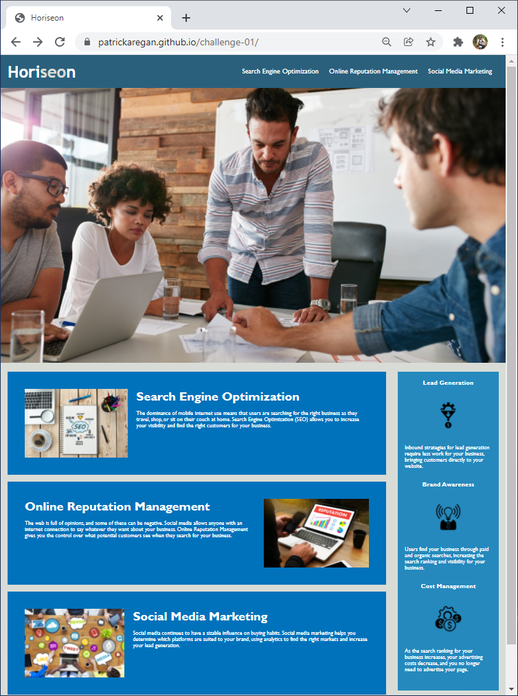

# patrickaregan.github.io/challenge-01/

## Description
- This project is about refactoring code that is given by a client to make sure it is
accessible to users with disabilities. The starter code is mentioned in the Credits.
- I want any code I work on to be as professional as possible and making it accessible
is one way to do that.
- Accessibility is important so people with disabilities can use the website.
- I learned about Semantic HTML and I will use that to improve the starter code.


## Screenshot

```md

```

## Link
[https://patrickaregan.github.io/challenge-01/](https://patrickaregan.github.io/challenge-01/)

## Credits

coding-boot-camp/urban-octo-telegram. (February 13, 2020). Code Refactor Starter Code.
Retrieved December 22, 2021,
from [https://github.com/coding-boot-camp/urban-octo-telegram](https://github.com/coding-boot-camp/)urban-octo-telegram
